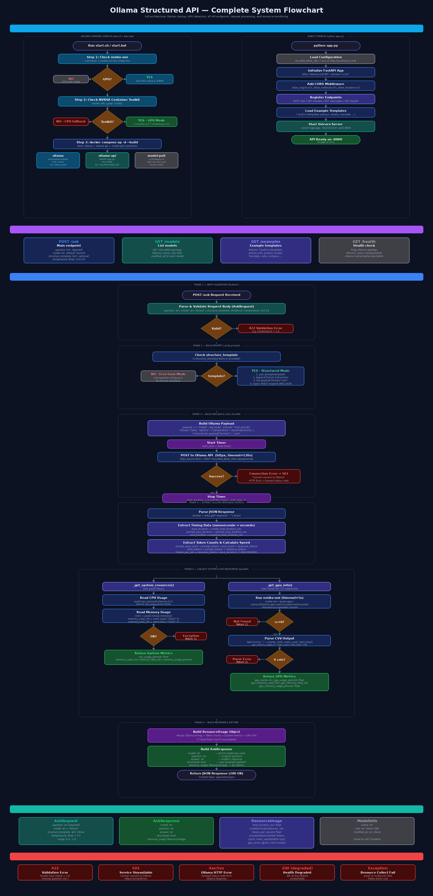

# Ollama Structured API

A FastAPI wrapper around [Ollama](https://ollama.com) that provides an open API for self-hosted LLM models with optional structured JSON output and resource usage monitoring.



## Features

- **Ask anything** — Send questions to any Ollama model via REST API
- **Structured output** — Optionally force the model to respond in a specific JSON structure
- **Model selection** — Choose from any model installed in your Ollama instance
- **Resource monitoring** — Every response includes CPU, memory, GPU usage, and token metrics
- **Auto GPU detection** — Startup script detects NVIDIA GPU and enables GPU passthrough
- **Centralized config** — Single `.env` file controls all ports, URLs, and defaults
- **Docker ready** — Run everything with a single command via Docker Compose
- **Swagger docs** — Interactive API documentation at `/docs`

## Project Structure

```
.
├── app.py                  # FastAPI application (main API code)
├── requirements.txt        # Python dependencies
├── .env                    # Configuration (ports, URLs, default model)
├── .env.example            # Configuration template
├── Dockerfile              # Container image for the API
├── docker-compose.yml      # Base Docker Compose (CPU mode)
├── docker-compose.gpu.yml  # GPU override (merged when NVIDIA detected)
├── start.sh                # Linux/macOS startup script (auto-detects GPU)
├── start.bat               # Windows startup script (auto-detects GPU)
├── flowchart.png           # System architecture flowchart
└── README.md               # This file
```

## Configuration

All settings are centralized in the `.env` file. Copy from the template and adjust:

```bash
cp .env.example .env
```

| Variable           | Default                    | Description                          |
|--------------------|----------------------------|--------------------------------------|
| `API_PORT`         | `8000`                     | Port for the FastAPI server          |
| `OLLAMA_PORT`      | `11434`                    | Port for the Ollama server           |
| `OLLAMA_BASE_URL`  | `http://localhost:11434`   | Ollama connection URL                |
| `DEFAULT_MODEL`    | `llama3`                   | Model to auto-pull on Docker startup |

Change any port once in `.env` — Docker, the API, and startup scripts all read from it automatically.

## Quick Start

### Option A: Direct (Ollama already installed)

```bash
# 1. Install Ollama: https://ollama.com/download
# 2. Pull a model
ollama pull llama3

# 3. Copy config and adjust if needed
cp .env.example .env

# 4. Install dependencies & run
pip install -r requirements.txt
python app.py
```

The API starts at `http://localhost:8000` (or whatever `API_PORT` you set in `.env`)

### Option B: Docker Compose

```bash
# 1. Copy config and adjust if needed
cp .env.example .env

# 2. Run (auto-detects GPU)
# Linux/macOS
chmod +x start.sh
./start.sh

# Windows
start.bat
```

The startup script automatically detects NVIDIA GPU, loads config from `.env`, and starts all services.

Or run manually:

```bash
# CPU only
docker compose up -d --build

# With GPU
docker compose -f docker-compose.yml -f docker-compose.gpu.yml up -d --build
```

## API Endpoints

| Method | Endpoint     | Description                              |
|--------|-------------|------------------------------------------|
| POST   | `/ask`      | Ask a question to an Ollama model        |
| GET    | `/models`   | List available Ollama models             |
| GET    | `/examples` | Get example structure templates          |
| GET    | `/health`   | Health check (API + Ollama connectivity) |
| GET    | `/docs`     | Swagger UI (interactive API docs)        |

## Usage Examples

### Simple Question (no structure)

```bash
curl -X POST http://localhost:8000/ask \
  -H "Content-Type: application/json" \
  -d '{
    "question": "What is Python?",
    "model": "llama3"
  }'
```

### Structured Output (with template)

When you provide `structure_template`, the API does two things:
1. Sets Ollama's `format: "json"` to force valid JSON output
2. Injects format instructions into the prompt so the model matches your exact structure

```bash
curl -X POST http://localhost:8000/ask \
  -H "Content-Type: application/json" \
  -d '{
    "question": "Tell me about Elon Musk",
    "model": "llama3",
    "structure_template": {
      "name": "string",
      "age": "number",
      "nationality": "string",
      "occupation": "string",
      "summary": "string"
    }
  }'
```

### Sentiment Analysis (with template)

```bash
curl -X POST http://localhost:8000/ask \
  -H "Content-Type: application/json" \
  -d '{
    "question": "Analyze the sentiment of: I love this product but the price is too high",
    "model": "llama3",
    "structure_template": {
      "sentiment": "overall sentiment",
      "word_and_score": {
        "positive_word_with_score": [
          { "word": "positive word", "score": "score 0-1" }
        ],
        "negative_word_with_score": [
          { "word": "negative word", "score": "score 0-1" }
        ]
      }
    }
  }'
```

### List Models

```bash
curl http://localhost:8000/models
```

### View Example Templates

```bash
curl http://localhost:8000/examples
```

Available templates: `person_info`, `product_review`, `translate`, `code_explanation`, `comparison`, `summary`, `sentiment_and_data_extraction`

## Request Parameters

| Parameter            | Type   | Required | Default    | Description                                  |
|---------------------|--------|----------|------------|----------------------------------------------|
| `question`          | string | Yes      | -          | The question/prompt to send                  |
| `model`             | string | No       | `"llama3"` | Ollama model name                            |
| `structure_template`| dict   | No       | `null`     | JSON template to force structured output     |
| `temperature`       | float  | No       | `0.7`      | Sampling temperature (0.0 - 2.0)             |

## Response Format

Every `/ask` response includes `resource_usage` metrics:

```json
{
  "model": "llama3",
  "question": "What is Python?",
  "answer": "Python is a high-level programming language...",
  "structured": false,
  "resource_usage": {
    "total_duration_sec": 2.345,
    "model_load_duration_sec": 0.102,
    "prompt_eval_duration_sec": 0.534,
    "response_eval_duration_sec": 1.709,
    "tokens_per_second": 48.3,
    "prompt_tokens": 15,
    "response_tokens": 82,
    "total_tokens": 97,
    "cpu_usage_percent": 45.2,
    "memory_used_mb": 8234.1,
    "memory_total_mb": 16384.0,
    "memory_usage_percent": 50.3,
    "gpu_name": "NVIDIA GeForce RTX 3060",
    "gpu_usage_percent": 87.0,
    "gpu_memory_used_mb": 4521.0,
    "gpu_memory_total_mb": 12288.0,
    "gpu_memory_usage_percent": 36.8
  }
}
```

### Resource Usage Fields

| Field                      | Type   | Source       | Description                          |
|---------------------------|--------|--------------|--------------------------------------|
| `total_duration_sec`      | float  | Timer        | Total request wall-clock time        |
| `model_load_duration_sec` | float  | Ollama       | Time to load model into memory       |
| `prompt_eval_duration_sec`| float  | Ollama       | Time to process the prompt           |
| `response_eval_duration_sec`| float| Ollama       | Time to generate the response        |
| `tokens_per_second`       | float  | Calculated   | Token generation speed               |
| `prompt_tokens`           | int    | Ollama       | Number of prompt tokens              |
| `response_tokens`         | int    | Ollama       | Number of generated tokens           |
| `total_tokens`            | int    | Calculated   | prompt_tokens + response_tokens      |
| `cpu_usage_percent`       | float  | psutil       | System CPU usage (%)                 |
| `memory_used_mb`          | float  | psutil       | System RAM used (MB)                 |
| `memory_total_mb`         | float  | psutil       | System total RAM (MB)                |
| `memory_usage_percent`    | float  | psutil       | System RAM usage (%)                 |
| `gpu_name`                | string | nvidia-smi   | GPU name (null if no NVIDIA GPU)     |
| `gpu_usage_percent`       | float  | nvidia-smi   | GPU utilization (%)                  |
| `gpu_memory_used_mb`      | float  | nvidia-smi   | GPU VRAM used (MB)                   |
| `gpu_memory_total_mb`     | float  | nvidia-smi   | GPU total VRAM (MB)                  |
| `gpu_memory_usage_percent`| float  | nvidia-smi   | GPU VRAM usage (%)                   |

## How Structured Output Works

The `structure_template` feature combines two mechanisms:

1. **Ollama's `format: "json"`** — Forces the model to output valid JSON (built-in Ollama feature)
2. **Prompt injection** — The API appends instructions to your question telling the model to match your exact template structure

Without `structure_template`, the model answers freely in plain text. With it, the model is constrained to return JSON matching your specified fields.

**Note:** Smaller models (< 7B parameters) may struggle to follow structured output instructions reliably. Use 7B+ models for best results.

## Error Handling

| Status | Error                | When                                    |
|--------|---------------------|-----------------------------------------|
| 422    | Validation Error    | Invalid input (e.g., temperature > 2.0) |
| 503    | Service Unavailable | Cannot connect to Ollama                |
| 4xx/5xx| Ollama HTTP Error   | Forwarded from Ollama response          |

Resource collection (CPU, GPU) failures are handled gracefully — fields return `null` instead of crashing.

## Pull More Models

```bash
# If using Ollama directly
ollama pull mistral
ollama pull codellama
ollama pull qwen2.5:7b

# If using Docker
docker exec ollama ollama pull mistral
```

Then select the model via the `model` field in your API request.

## Requirements

- Python 3.10+
- Ollama running locally (or via Docker)
- NVIDIA GPU + Container Toolkit (optional, for GPU acceleration)
- Docker & Docker Compose (optional, for containerized deployment)
